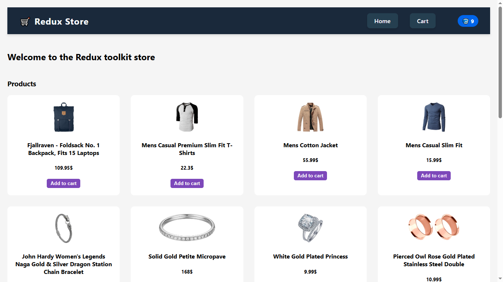
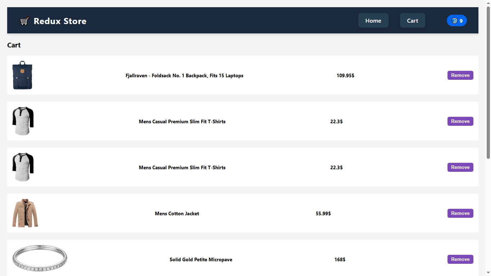

# 🛒 Redux Store

A modern, responsive shopping cart application built with **React**, **Redux Toolkit**, and **React Router**. Products are fetched from the [Fake Store API](https://fakestoreapi.com/), and the cart is fully functional with localStorage persistence.

---

## 🚀 Features

- 🛍 View and browse products
- ➕ Add items to cart with unique IDs
- ❌ Remove items from cart
- ♻️ Cart state is persisted in `localStorage`
- 🧭 Smooth navigation using React Router
- ⚡ Global state management with Redux Toolkit
- 🎨 Clean and responsive UI with custom CSS

---

## 🛠 Tech Stack

- **React**
- **Redux Toolkit**
- **React Redux**
- **React Router DOM**
- **Fake Store API**
- **localStorage** for state persistence
- **CSS** for styling

---

## 📁 Folder Structure

```
redux-store/
│
├── public/
├── src/
│ ├── components/
│ │ ├── Navbar.js
│ │ └── Cart.js
│ ├── pages/
│ │ └── Home.js
│ ├── store/
│ │ ├── cartSlice.js
│ │ └── productSlice.js
│ ├── App.js
│ ├── index.js
│ └── App.css
├── package.json
└── README.md

```
---
# 📸 Live preview





---

## 🧑‍💻 Getting Started

### 1. Clone the repo
```bash
git clone https://github.com/Saurabhsaxena81/redux-store-ecom.git
cd redux-store
